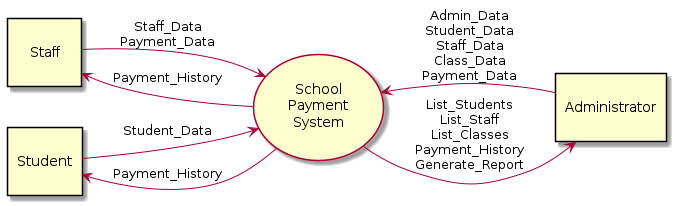
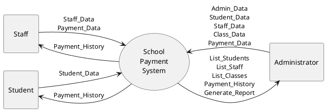

# Context Diagram

```puml
@startuml

' Diagram Konteks
(\nSchool\nPayment\nSystem\n) as SPS

' Entitas eksternal yang terlibat.
rectangle "\nAdministrator\n" as Admin
rectangle "\n   Staff   \n" as Staff
rectangle "\nStudent\n" as Student

' Orientasi diagram ini dari kiri ke kanan.
left to right direction

' Aliran data yang mengalir dari sistem ke entitas eksternal.
Student --> SPS : Student_Data
Staff   --> SPS : Staff_Data\nPayment_Data
Admin   -up-> SPS : Admin_Data\nStudent_Data\nStaff_Data\nClass_Data\nPayment_Data

Student <-- SPS : Payment_History
Staff   <-- SPS : Payment_History
Admin   <-- SPS : List_Students\nList_Staff\nList_Classes\nPayment_History\nGenerate_Report

@enduml
```