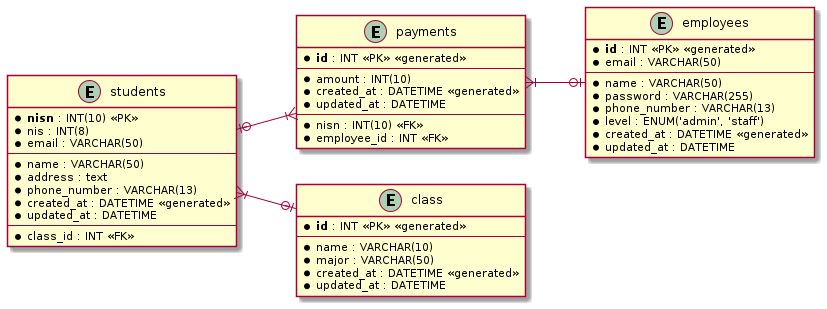
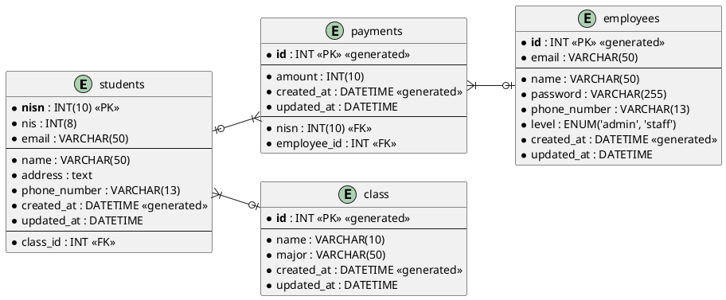

# Entity Relationship Diagram

## Physical Data Model

```puml
@startuml

left to right direction

entity students {
  * **nisn** : INT(10) <<PK>>
  * nis : INT(8)
  * email : VARCHAR(50)
  --
  * name : VARCHAR(50)
  * address : text
  * phone_number : VARCHAR(13)
  ' DEFAULT CURRENT_TIMESTAMP
  * created_at : DATETIME <<generated>>
  * updated_at : DATETIME
  --
  ' FOREIGN KEY (class_id) REFERENCES class(id)
  * class_id : INT <<FK>>
}

entity employees {
  * **id** : INT <<PK>> <<generated>>
  * email : VARCHAR(50)
  --
  * name : VARCHAR(50)
  * password : VARCHAR(255)
  * phone_number : VARCHAR(13)
  * level : ENUM('admin', 'staff')
  * created_at : DATETIME <<generated>>
  * updated_at : DATETIME
}
  
entity payments {
  * **id** : INT <<PK>> <<generated>>
  --
  * amount : INT(10)
  * created_at : DATETIME <<generated>>
  * updated_at : DATETIME
  --
  * nisn : INT(10) <<FK>>
  * employee_id : INT <<FK>>
}
  
entity class {
  * **id** : INT <<PK>> <<generated>>
  --
  * name : VARCHAR(10)
  * major : VARCHAR(50)
  * created_at : DATETIME <<generated>>
  * updated_at : DATETIME
}

class    |o-up-|{ students
students |o--|{ payments
payments }|--o| employees

@enduml
```