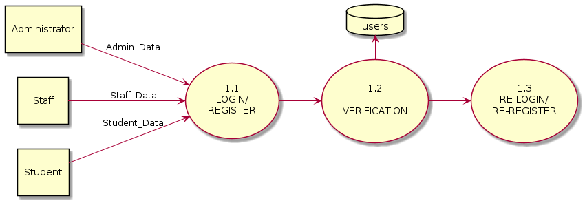
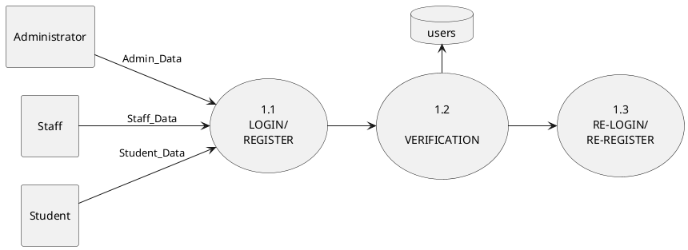

# Level-1 Diagram

```puml
@startuml

' Diagram Level-1
' Proses bisnis yang terjadi.
(\n1.1\nLOGIN/\nREGISTER\n) as Login
(\n1.2\n\nVERIFICATION\n) as Verification
(\n1.3\nRE-LOGIN/\nRE-REGISTER\n) as Relogin

' Entitas eksternal yang terlibat.
rectangle "\nAdministrator\n" as Admin
rectangle "\n   Staff   \n" as Staff
rectangle "\nStudent\n" as Student

database "   users   " as users

' Orientasi diagram ini dari kiri ke kanan.
left to right direction

' Aliran data yang mengalir dari sistem ke entitas eksternal.
' 1.0 Proses Masuk/Daftar
Student      --> Login : Student_Data
Staff        --> Login : Staff_Data
Admin        --> Login : Admin_Data
Login        --> Verification
Verification --> Relogin
Verification -left-> users

@enduml
```