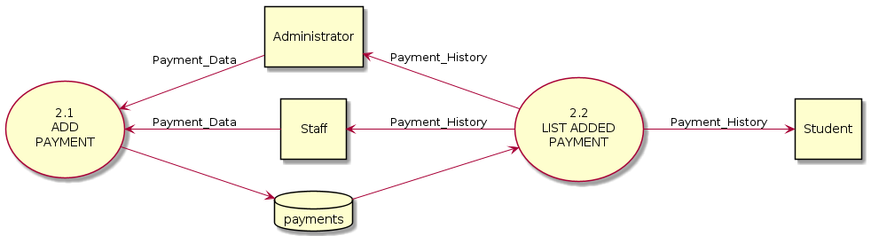
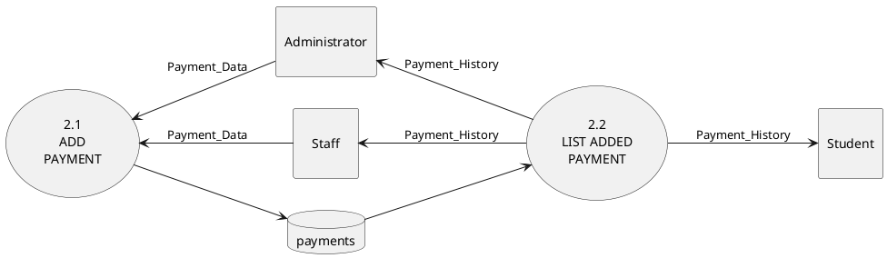

# Level-2 Diagram 

```puml
@startuml

' Diagram Level-2
' Proses bisnis yang terjadi.
(\n2.1\nADD\nPAYMENT\n) as Add
(\n2.2\nLIST ADDED\nPAYMENT\n) as List

' Entitas eksternal yang terlibat.
rectangle "\nAdministrator\n" as Admin
rectangle "\n   Staff   \n" as Staff
rectangle "\nStudent\n" as Student

database payments

' Orientasi diagram ini dari kiri ke kanan.
left to right direction

' Aliran data yang mengalir dari sistem ke entitas eksternal.
' 2.0 Proses Pembayaran
Add <-- Staff  : Payment_Data
Add <-- Admin : Payment_Data
Add --> payments

payments --> List
List     --> Student : Payment_History
Staff    <-- List : Payment_History
Admin    <-- List : Payment_History

@enduml
```