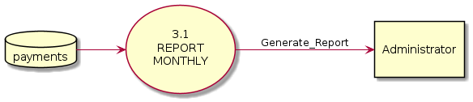
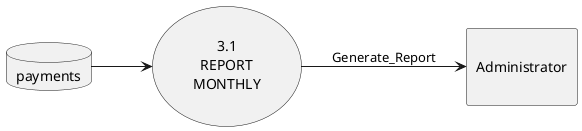

# Level-3 Diagram

```puml
@startuml

' Diagram Level-3
' Proses bisnis yang terjadi.
(\n3.1\nREPORT\nMONTHLY\n) as Report

' Entitas eksternal yang terlibat.
rectangle "\nAdministrator\n" as Admin

database payments

' Orientasi diagram ini dari kiri ke kanan.
left to right direction

' Aliran data yang mengalir dari sistem ke entitas eksternal.
' 3.0 Proses Laporan
payments --> Report
Report   --> Admin : Generate_Report

@enduml
```