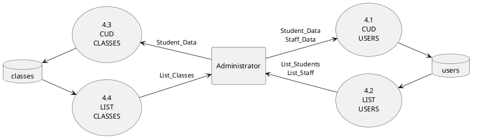

# Level-4 Diagram

```puml
@startuml

' Diagram Level-4
' Proses bisnis yang terjadi.
(\n4.1\nCUD\nUSERS\n) as CUDUsers
(\n4.2\nLIST\nUSERS\n) as ListUsers
(\n4.3\nCUD\nCLASSES\n) as CUDClasses
(\n4.4\nLIST\nCLASSES\n) as ListClasses

' Entitas eksternal yang terlibat.
rectangle "\nAdministrator\n" as Admin

database "   users   " as users
database "  classes  " as classes

' Orientasi diagram ini dari kiri ke kanan.
left to right direction

' Aliran data yang mengalir dari sistem ke entitas eksternal.
' 4.0 Proses Laporan
Admin     --> CUDUsers : Student_Data\nStaff_Data
Admin     <-- ListUsers : List_Students\nList_Staff
CUDUsers  --> users
ListUsers <-- users

CUDClasses  <-- Admin : Student_Data
ListClasses --> Admin : List_Classes
classes     <-- CUDClasses
classes     --> ListClasses 

@enduml
```