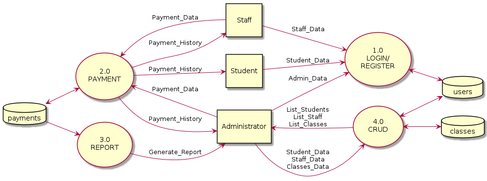
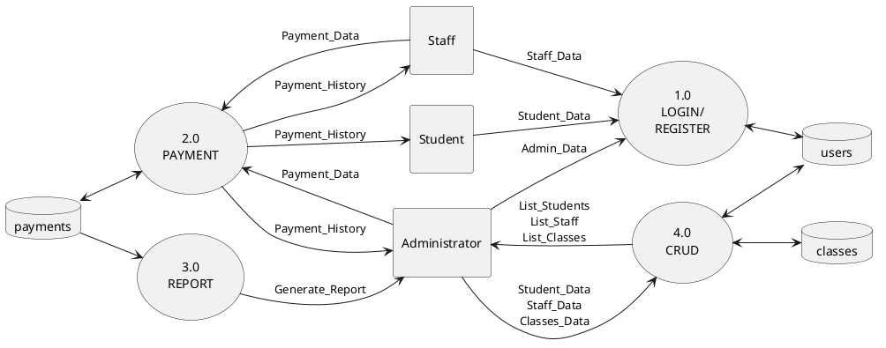

# Zero Diagram

```puml
@startuml

' Diagram Level-0
' Proses bisnis yang terjadi.
(\n1.0\nLOGIN/\nREGISTER\n) as Login
(\n2.0\nPAYMENT\n) as Payment
(\n3.0\nREPORT\n) as Report
(\n4.0\nCRUD\n) as CRUD

' Entitas eksternal yang terlibat.
rectangle "\nAdministrator\n" as Admin
rectangle "\n   Staff   \n" as Staff
rectangle "\nStudent\n" as Student

database "   users   " as users
database payments
database "  classes  " as classes

' Orientasi diagram ini dari kiri ke kanan.
left to right direction

' Aliran data yang mengalir dari sistem ke entitas eksternal.
' 1.0 Proses Masuk/Daftar
Student --> Login : Student_Data
Staff   --> Login : Staff_Data
Admin   --> Login : Admin_Data
Login   <--> users

' 2.0 Proses Pembayaran
Payment <-- Admin : Payment_Data
Payment --> Admin : Payment_History
Payment <-- Staff : Payment_Data
Payment --> Staff : Payment_History
Payment --> Student : Payment_History
payments <--> Payment

' 3.0 Proses Laporan
Report   --> Admin : Generate_Report
payments --> Report

' 4.0 Proses CRUD
Admin --> CRUD : Student_Data\nStaff_Data\nClasses_Data
Admin <-- CRUD : List_Students\nList_Staff\nList_Classes
CRUD <--> users
CRUD <--> classes

@enduml
```